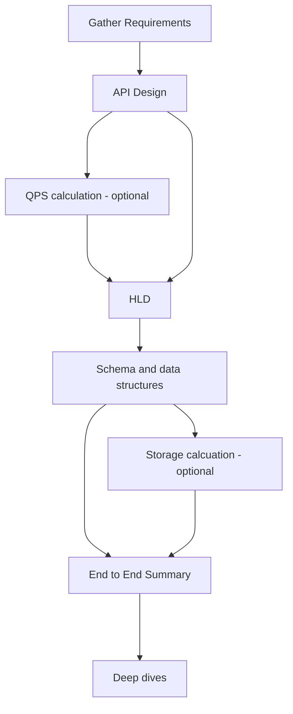

# System Design Interview Notes

## Interview flow

#### Timings
- Gather Requirements (5-7 mins)
	- Functional (2 mins)
	- Non-functional (3-4 mins)
- API Design (3-5 mins)
- Define High-Level Diagram (5-7 mins)
- Define Schema and Data Structure (5-7 mins)
- End to End Flow (2-3 mins)
- Discuss Deep Dives (15-20 mins)

### Requirement gathering
#### Functional
Ask the following:
1.  Who is it for, and why do we need to build it? 
2.  What are the features we need to solve the users’ problem?

#### Non-Functional Requirements
##### Scale
- How Many Active Users Are There in the System? 
- How Are the Users Distributed Across the World?
- What Are Some Scenarios That Could Lead to High QPS?
-  What Are Some Scenarios That Could Lead to High Storage and Bandwidth?
##### Performance Constraints
 - CAP
 - Accuracy constraints?
 - Response latency constraints
 - Freshness requirement
 - Durability Requirement
 
### Deep Dive Design
#### Discussion Points
##### API and Interprocess Calls
- Latency
- High QPS
- Bursty of the API / Thundering Herd
- Slow, Low Bandwidth, Congested Network
- Query Optimisation
##### Micro Services, Queue, and Databases
- Failure Scenario
- High Amount of Data
- Concurrency
-  Operational Issues and Metrics
- Security Considerations
